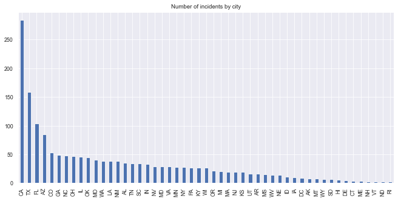
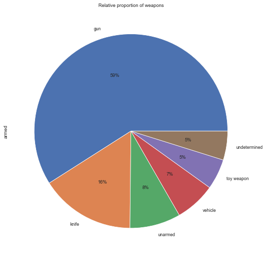
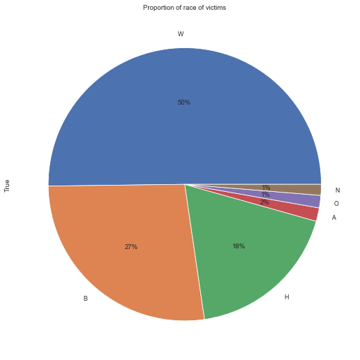
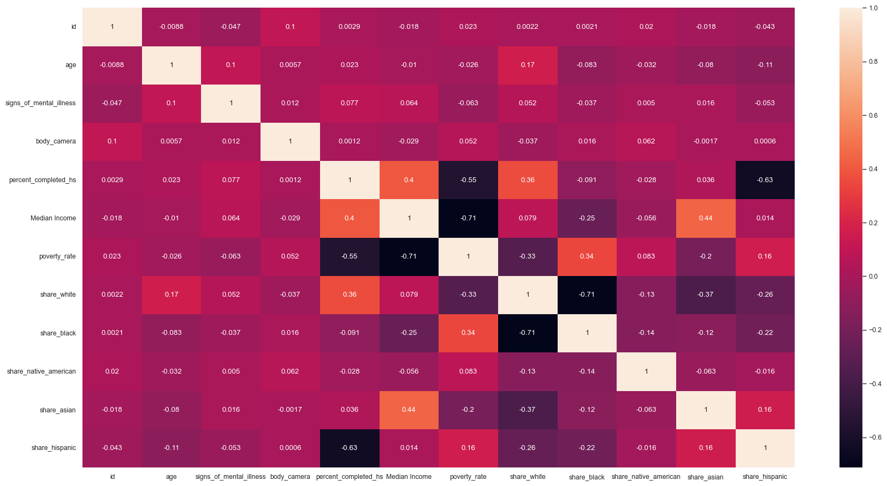
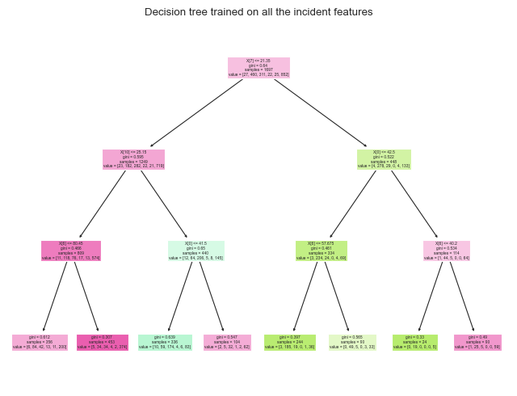
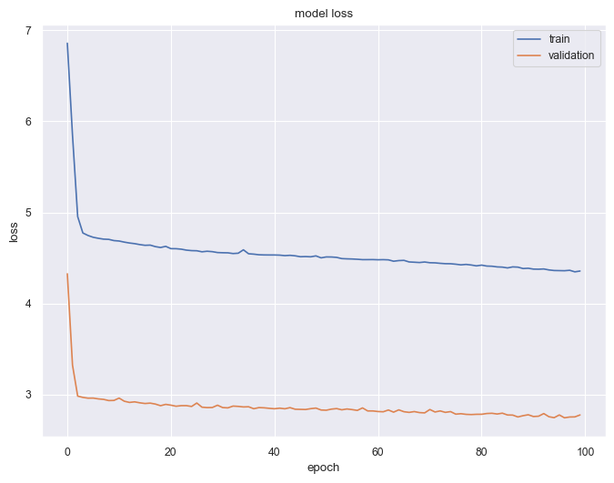

# Use of Fatal Force by the US Police

Co-authored by Chun Sang Au Yong and Paavankumar Avasatthi. Paav is responsible for Exploratory Data Analysis, while Chun Sang is responsible for the rest.

## Introduction
In the United States, use of deadly force by police has been a high-profile and contentious issue. 1000 people are shot and killed by US cops each year. The ever-growing argument is that the US has a flawed Law Enforcement system that costs too many innocent civilians their lives. In this project, we will analyze one of America’s hottest political topics, which encompasses issues ranging from institutional racism to the role of Law Enforcement personnel in society.

We will use 5 data sets in this study. Four of them describes demographics of cities in the US (city data sets) while the remaining one records the fatal incidents (police data set).


```python
import pandas as pd 
import matplotlib.pyplot as plt 
import numpy as np
import seaborn as sns
import pickle

from sklearn.tree import plot_tree, DecisionTreeClassifier
from sklearn.linear_model import LinearRegression, LogisticRegression, LogisticRegressionCV
from sklearn.ensemble import RandomForestClassifier
from sklearn.model_selection import train_test_split
from sklearn.preprocessing import MinMaxScaler
from sklearn.metrics import mean_squared_error, mean_absolute_error

import tensorflow as tf
from tensorflow.python.keras.layers import Dense
from tensorflow.python.keras.models import Sequential
```

## Data Preprocessing


```python
education = pd.read_csv('data/education.csv', encoding = "ISO-8859-1")
income = pd.read_csv('data/income.csv', encoding = "ISO-8859-1")
poverty = pd.read_csv('data/poverty.csv', encoding = "ISO-8859-1")
race = pd.read_csv('data/share_race_by_city.csv', encoding = "ISO-8859-1")
test = pd.read_csv('data/police_killings_test.csv', encoding = "ISO-8859-1")
train = pd.read_csv('data/police_killings_train.csv', encoding = "ISO-8859-1")
```

We first inspect and clean null data.


```python
train.isnull().sum()
```


    id                          0
    name                        0
    date                        0
    manner_of_death             0
    armed                       6
    age                        37
    gender                      0
    race                       91
    city                        0
    state                       0
    signs_of_mental_illness     0
    threat_level                0
    flee                       27
    body_camera                 0
    dtype: int64


```python
def clean_dataset(df):
    assert isinstance(df, pd.DataFrame)
    df.dropna(inplace=True)
    indices_to_keep = ~df.isin([np.nan, np.inf, -np.inf]).any(1)
    return df[indices_to_keep]
```


```python
train = clean_dataset(train)
test = clean_dataset(test)
```

### Merging Counts to City Data Sets

By merging the count of fatal incident grouped by city to the city data sets, we can perform linear regression using demographics as independent variables and count as a depedent variable.

There is a discrepancy between the encoding of names between the police data set and city data sets. For example, the former refer LA in California as Los Angeles while the latter uses Los Angeles city.

We also observe that the police data set provide less information because it only has Chicago as a city, while the city data sets have Chicago city, Chicago Heights city and Chicago Ridge village. Assuming that cities bearing similar name should be geographically and demographically close to each other, we shall evenly distribute the number of fatal incidents between them.


```python
# count the number of incidents grouping by city and state because city names may duplicate
df = pd.concat([train, test], ignore_index=True)
city_count = df.value_counts(['city', 'state']).rename_axis(['City', 'Geographic Area']).reset_index(name='Counts')
city_count.head()
```


<div>
<style scoped>
    .dataframe tbody tr th:only-of-type {
        vertical-align: middle;
    }

    .dataframe tbody tr th {
        vertical-align: top;
    }

    .dataframe thead th {
        text-align: right;
    }
</style>
<table border="1" class="dataframe">
  <thead>
    <tr style="text-align: right;">
      <th></th>
      <th>City</th>
      <th>Geographic Area</th>
      <th>Counts</th>
    </tr>
  </thead>
  <tbody>
    <tr>
      <th>0</th>
      <td>Los Angeles</td>
      <td>CA</td>
      <td>35</td>
    </tr>
    <tr>
      <th>1</th>
      <td>Phoenix</td>
      <td>AZ</td>
      <td>28</td>
    </tr>
    <tr>
      <th>2</th>
      <td>Houston</td>
      <td>TX</td>
      <td>23</td>
    </tr>
    <tr>
      <th>3</th>
      <td>Chicago</td>
      <td>IL</td>
      <td>22</td>
    </tr>
    <tr>
      <th>4</th>
      <td>Las Vegas</td>
      <td>NV</td>
      <td>17</td>
    </tr>
  </tbody>
</table>
</div>


```python
city = education.merge(income, on=['Geographic Area', 'City']).merge(poverty, on=['Geographic Area', 'City']).merge(race, on=['Geographic Area', 'City'])
city.head()
```


<div>
<style scoped>
    .dataframe tbody tr th:only-of-type {
        vertical-align: middle;
    }

    .dataframe tbody tr th {
        vertical-align: top;
    }

    .dataframe thead th {
        text-align: right;
    }
</style>
<table border="1" class="dataframe">
  <thead>
    <tr style="text-align: right;">
      <th></th>
      <th>Geographic Area</th>
      <th>City</th>
      <th>percent_completed_hs</th>
      <th>Median Income</th>
      <th>poverty_rate</th>
      <th>share_white</th>
      <th>share_black</th>
      <th>share_native_american</th>
      <th>share_asian</th>
      <th>share_hispanic</th>
    </tr>
  </thead>
  <tbody>
    <tr>
      <th>0</th>
      <td>AL</td>
      <td>Abanda CDP</td>
      <td>21.2</td>
      <td>11207</td>
      <td>78.8</td>
      <td>67.2</td>
      <td>30.2</td>
      <td>0</td>
      <td>0</td>
      <td>1.6</td>
    </tr>
    <tr>
      <th>1</th>
      <td>AL</td>
      <td>Abbeville city</td>
      <td>69.1</td>
      <td>25615</td>
      <td>29.1</td>
      <td>54.4</td>
      <td>41.4</td>
      <td>0.1</td>
      <td>1</td>
      <td>3.1</td>
    </tr>
    <tr>
      <th>2</th>
      <td>AL</td>
      <td>Adamsville city</td>
      <td>78.9</td>
      <td>42575</td>
      <td>25.5</td>
      <td>52.3</td>
      <td>44.9</td>
      <td>0.5</td>
      <td>0.3</td>
      <td>2.3</td>
    </tr>
    <tr>
      <th>3</th>
      <td>AL</td>
      <td>Addison town</td>
      <td>81.4</td>
      <td>37083</td>
      <td>30.7</td>
      <td>99.1</td>
      <td>0.1</td>
      <td>0</td>
      <td>0.1</td>
      <td>0.4</td>
    </tr>
    <tr>
      <th>4</th>
      <td>AL</td>
      <td>Akron town</td>
      <td>68.6</td>
      <td>21667</td>
      <td>42</td>
      <td>13.2</td>
      <td>86.5</td>
      <td>0</td>
      <td>0</td>
      <td>0.3</td>
    </tr>
  </tbody>
</table>
</div>


```python
def merge_count(record):
    # find record(s) matching both name and state
    match_city = city_total['City'].str.startswith(record['City'])
    match_state = city_total['Geographic Area'] == record['Geographic Area']
    match_both = np.logical_and(match_city, match_state)
    # count the number of True
    length = np.count_nonzero(match_both)
    if length == 1:     # if unique
        city_total.loc[match_both, 'Counts'] = record['Counts']
    elif length > 1:    # if multiple, take average
        count = record['Counts']/length
        city_total.loc[match_both, 'Counts'] = count

city_total = city.copy()    # changes to city_total will not affect city
city_total['Counts'] = 0
city_count.apply(merge_count, axis=1)
```


    0       None
    1       None
    2       None
    3       None
    4       None
            ... 
    1377    None
    1378    None
    1379    None
    1380    None
    1381    None
    Length: 1382, dtype: object


```python
city_total.sort_values(by='Counts', ascending=False).head()
```


<div>
<style scoped>
    .dataframe tbody tr th:only-of-type {
        vertical-align: middle;
    }

    .dataframe tbody tr th {
        vertical-align: top;
    }

    .dataframe thead th {
        text-align: right;
    }
</style>
<table border="1" class="dataframe">
  <thead>
    <tr style="text-align: right;">
      <th></th>
      <th>Geographic Area</th>
      <th>City</th>
      <th>percent_completed_hs</th>
      <th>Median Income</th>
      <th>poverty_rate</th>
      <th>share_white</th>
      <th>share_black</th>
      <th>share_native_american</th>
      <th>share_asian</th>
      <th>share_hispanic</th>
      <th>Counts</th>
    </tr>
  </thead>
  <tbody>
    <tr>
      <th>2701</th>
      <td>CA</td>
      <td>Los Angeles city</td>
      <td>75.5</td>
      <td>50205</td>
      <td>22.1</td>
      <td>49.8</td>
      <td>9.6</td>
      <td>0.7</td>
      <td>11.3</td>
      <td>48.5</td>
      <td>35.0</td>
    </tr>
    <tr>
      <th>1198</th>
      <td>AZ</td>
      <td>Phoenix city</td>
      <td>80.7</td>
      <td>47326</td>
      <td>23.1</td>
      <td>65.9</td>
      <td>6.5</td>
      <td>2.2</td>
      <td>3.2</td>
      <td>40.8</td>
      <td>28.0</td>
    </tr>
    <tr>
      <th>25036</th>
      <td>TX</td>
      <td>Houston city</td>
      <td>76.7</td>
      <td>46187</td>
      <td>22.5</td>
      <td>50.5</td>
      <td>23.7</td>
      <td>0.7</td>
      <td>6</td>
      <td>43.8</td>
      <td>23.0</td>
    </tr>
    <tr>
      <th>15596</th>
      <td>NV</td>
      <td>Las Vegas city</td>
      <td>83.3</td>
      <td>50202</td>
      <td>17.5</td>
      <td>62.1</td>
      <td>11.1</td>
      <td>0.7</td>
      <td>6.1</td>
      <td>31.5</td>
      <td>17.0</td>
    </tr>
    <tr>
      <th>24428</th>
      <td>TX</td>
      <td>Austin city</td>
      <td>87.5</td>
      <td>57689</td>
      <td>18</td>
      <td>68.3</td>
      <td>8.1</td>
      <td>0.9</td>
      <td>6.3</td>
      <td>35.1</td>
      <td>16.0</td>
    </tr>
  </tbody>
</table>
</div>


### Merging City Data Sets to the Police Data Set

By merging the city demographics to the police data set, we can append background information to each of the incident. In this study, we will use various city demographics as independent variables to predict the race of victim.


```python
fields = ['percent_completed_hs', 'Median Income', 'poverty_rate', 'share_white', 'share_black', 'share_native_american', 'share_asian', 'share_hispanic']

def merge_city(record):
    # find record(s) matching both name and state
    match_city = city['City'].str.startswith(record['city'])
    match_state = city['Geographic Area'] == record['state']
    match_both = np.logical_and(match_city, match_state)
    match = city.loc[match_both]
    # assign the mean of city demographics to the police data set
    for field in fields:
        record.loc[field] = pd.to_numeric(match[field], errors='coerce').mean()
    return record[fields]

train[fields] = train.apply(merge_city, axis=1)
test[fields] = test.apply(merge_city, axis=1)
```


```python
train.head()
```


<div>
<style scoped>
    .dataframe tbody tr th:only-of-type {
        vertical-align: middle;
    }

    .dataframe tbody tr th {
        vertical-align: top;
    }

    .dataframe thead th {
        text-align: right;
    }
</style>
<table border="1" class="dataframe">
  <thead>
    <tr style="text-align: right;">
      <th></th>
      <th>id</th>
      <th>name</th>
      <th>date</th>
      <th>manner_of_death</th>
      <th>armed</th>
      <th>age</th>
      <th>gender</th>
      <th>race</th>
      <th>city</th>
      <th>state</th>
      <th>...</th>
      <th>flee</th>
      <th>body_camera</th>
      <th>percent_completed_hs</th>
      <th>Median Income</th>
      <th>poverty_rate</th>
      <th>share_white</th>
      <th>share_black</th>
      <th>share_native_american</th>
      <th>share_asian</th>
      <th>share_hispanic</th>
    </tr>
  </thead>
  <tbody>
    <tr>
      <th>0</th>
      <td>3</td>
      <td>Tim Elliot</td>
      <td>02/01/15</td>
      <td>shot</td>
      <td>gun</td>
      <td>53.0</td>
      <td>M</td>
      <td>A</td>
      <td>Shelton</td>
      <td>WA</td>
      <td>...</td>
      <td>Not fleeing</td>
      <td>False</td>
      <td>80.1</td>
      <td>37072.0</td>
      <td>28.6</td>
      <td>78.9</td>
      <td>0.8</td>
      <td>3.7</td>
      <td>1.1</td>
      <td>19.2</td>
    </tr>
    <tr>
      <th>1</th>
      <td>4</td>
      <td>Lewis Lee Lembke</td>
      <td>02/01/15</td>
      <td>shot</td>
      <td>gun</td>
      <td>47.0</td>
      <td>M</td>
      <td>W</td>
      <td>Aloha</td>
      <td>OR</td>
      <td>...</td>
      <td>Not fleeing</td>
      <td>False</td>
      <td>88.1</td>
      <td>65765.0</td>
      <td>14.9</td>
      <td>70.9</td>
      <td>2.6</td>
      <td>1.0</td>
      <td>8.9</td>
      <td>21.1</td>
    </tr>
    <tr>
      <th>2</th>
      <td>5</td>
      <td>John Paul Quintero</td>
      <td>03/01/15</td>
      <td>shot and Tasered</td>
      <td>unarmed</td>
      <td>23.0</td>
      <td>M</td>
      <td>H</td>
      <td>Wichita</td>
      <td>KS</td>
      <td>...</td>
      <td>Not fleeing</td>
      <td>False</td>
      <td>87.5</td>
      <td>45947.0</td>
      <td>17.3</td>
      <td>71.9</td>
      <td>11.5</td>
      <td>1.2</td>
      <td>4.8</td>
      <td>15.3</td>
    </tr>
    <tr>
      <th>3</th>
      <td>8</td>
      <td>Matthew Hoffman</td>
      <td>04/01/15</td>
      <td>shot</td>
      <td>toy weapon</td>
      <td>32.0</td>
      <td>M</td>
      <td>W</td>
      <td>San Francisco</td>
      <td>CA</td>
      <td>...</td>
      <td>Not fleeing</td>
      <td>False</td>
      <td>87.0</td>
      <td>81294.0</td>
      <td>13.2</td>
      <td>48.5</td>
      <td>6.1</td>
      <td>0.5</td>
      <td>33.3</td>
      <td>15.1</td>
    </tr>
    <tr>
      <th>4</th>
      <td>9</td>
      <td>Michael Rodriguez</td>
      <td>04/01/15</td>
      <td>shot</td>
      <td>nail gun</td>
      <td>39.0</td>
      <td>M</td>
      <td>H</td>
      <td>Evans</td>
      <td>CO</td>
      <td>...</td>
      <td>Not fleeing</td>
      <td>False</td>
      <td>76.3</td>
      <td>47791.0</td>
      <td>16.6</td>
      <td>76.5</td>
      <td>0.9</td>
      <td>1.2</td>
      <td>0.9</td>
      <td>43.1</td>
    </tr>
  </tbody>
</table>
<p>5 rows × 22 columns</p>
</div>


Since some rows in the police data set do not have corresponding cities, they will have NaN values which needs to be cleaned.


```python
train = clean_dataset(train)
test = clean_dataset(test)
```


```python
train.to_csv('processed/train.csv', index=False)
test.to_csv('processed/test.csv', index=False)
```

## Exploratory Data Analysis


```python
train.interpolate()
train.isnull().sum()
```


    id                         0
    name                       0
    date                       0
    manner_of_death            0
    armed                      0
    age                        0
    gender                     0
    race                       0
    city                       0
    state                      0
    signs_of_mental_illness    0
    threat_level               0
    flee                       0
    body_camera                0
    percent_completed_hs       0
    Median Income              0
    poverty_rate               0
    share_white                0
    share_black                0
    share_native_american      0
    share_asian                0
    share_hispanic             0
    dtype: int64


```python
train.shape
```


    (1697, 22)


```python
train.info(verbose=True)
```

    <class 'pandas.core.frame.DataFrame'>
    Int64Index: 1697 entries, 0 to 2027
    Data columns (total 22 columns):
     #   Column                   Non-Null Count  Dtype  
    ---  ------                   --------------  -----  
     0   id                       1697 non-null   int64  
     1   name                     1697 non-null   object 
     2   date                     1697 non-null   object 
     3   manner_of_death          1697 non-null   object 
     4   armed                    1697 non-null   object 
     5   age                      1697 non-null   float64
     6   gender                   1697 non-null   object 
     7   race                     1697 non-null   object 
     8   city                     1697 non-null   object 
     9   state                    1697 non-null   object 
     10  signs_of_mental_illness  1697 non-null   bool   
     11  threat_level             1697 non-null   object 
     12  flee                     1697 non-null   object 
     13  body_camera              1697 non-null   bool   
     14  percent_completed_hs     1697 non-null   float64
     15  Median Income            1697 non-null   float64
     16  poverty_rate             1697 non-null   float64
     17  share_white              1697 non-null   float64
     18  share_black              1697 non-null   float64
     19  share_native_american    1697 non-null   float64
     20  share_asian              1697 non-null   float64
     21  share_hispanic           1697 non-null   float64
    dtypes: bool(2), float64(9), int64(1), object(10)
    memory usage: 281.7+ KB
    


```python
train.describe()
```


<div>
<style scoped>
    .dataframe tbody tr th:only-of-type {
        vertical-align: middle;
    }

    .dataframe tbody tr th {
        vertical-align: top;
    }

    .dataframe thead th {
        text-align: right;
    }
</style>
<table border="1" class="dataframe">
  <thead>
    <tr style="text-align: right;">
      <th></th>
      <th>id</th>
      <th>age</th>
      <th>percent_completed_hs</th>
      <th>Median Income</th>
      <th>poverty_rate</th>
      <th>share_white</th>
      <th>share_black</th>
      <th>share_native_american</th>
      <th>share_asian</th>
      <th>share_hispanic</th>
    </tr>
  </thead>
  <tbody>
    <tr>
      <th>count</th>
      <td>1697.000000</td>
      <td>1697.000000</td>
      <td>1697.000000</td>
      <td>1697.000000</td>
      <td>1697.000000</td>
      <td>1697.000000</td>
      <td>1697.000000</td>
      <td>1697.000000</td>
      <td>1697.000000</td>
      <td>1697.000000</td>
    </tr>
    <tr>
      <th>mean</th>
      <td>1149.212139</td>
      <td>35.873306</td>
      <td>84.316807</td>
      <td>49455.544603</td>
      <td>19.367568</td>
      <td>67.292879</td>
      <td>15.205275</td>
      <td>1.432133</td>
      <td>4.359952</td>
      <td>20.627339</td>
    </tr>
    <tr>
      <th>std</th>
      <td>632.922020</td>
      <td>12.483521</td>
      <td>8.365033</td>
      <td>16450.198560</td>
      <td>8.087651</td>
      <td>19.467030</td>
      <td>17.309810</td>
      <td>4.954118</td>
      <td>6.374263</td>
      <td>20.176668</td>
    </tr>
    <tr>
      <th>min</th>
      <td>3.000000</td>
      <td>6.000000</td>
      <td>33.150000</td>
      <td>17438.000000</td>
      <td>0.000000</td>
      <td>0.900000</td>
      <td>0.000000</td>
      <td>0.000000</td>
      <td>0.000000</td>
      <td>0.000000</td>
    </tr>
    <tr>
      <th>25%</th>
      <td>617.000000</td>
      <td>26.000000</td>
      <td>80.700000</td>
      <td>39681.000000</td>
      <td>14.300000</td>
      <td>52.700000</td>
      <td>2.500000</td>
      <td>0.300000</td>
      <td>1.000000</td>
      <td>5.133333</td>
    </tr>
    <tr>
      <th>50%</th>
      <td>1151.000000</td>
      <td>34.000000</td>
      <td>85.600000</td>
      <td>46912.000000</td>
      <td>19.000000</td>
      <td>69.700000</td>
      <td>8.400000</td>
      <td>0.600000</td>
      <td>2.400000</td>
      <td>12.700000</td>
    </tr>
    <tr>
      <th>75%</th>
      <td>1688.000000</td>
      <td>44.000000</td>
      <td>89.800000</td>
      <td>54618.000000</td>
      <td>23.400000</td>
      <td>82.500000</td>
      <td>22.600000</td>
      <td>1.000000</td>
      <td>5.000000</td>
      <td>32.700000</td>
    </tr>
    <tr>
      <th>max</th>
      <td>2260.000000</td>
      <td>83.000000</td>
      <td>100.000000</td>
      <td>198839.000000</td>
      <td>76.400000</td>
      <td>100.000000</td>
      <td>98.000000</td>
      <td>95.000000</td>
      <td>61.900000</td>
      <td>97.800000</td>
    </tr>
  </tbody>
</table>
</div>


```python
train.nunique()
```


    id                         1697
    name                       1693
    date                        672
    manner_of_death               2
    armed                        56
    age                          69
    gender                        2
    race                          6
    city                        941
    state                        51
    signs_of_mental_illness       2
    threat_level                  3
    flee                          4
    body_camera                   2
    percent_completed_hs        362
    Median Income               995
    poverty_rate                381
    share_white                 543
    share_black                 409
    share_native_american       114
    share_asian                 199
    share_hispanic              433
    dtype: int64


We now investigate how the fatal police shootings vary based on the different geographic loactions. The train dataset has 51 unique values for state. These include Washington DC in addition to the 50 states within the United States. We can see that CA has the highest the count of all state values present in the train dataset. 


```python
fig, ax = plt.subplots(figsize=(9, 4.5), layout='constrained')
train['state'].value_counts().plot(kind='bar')
ax.set_title("Number of incidents by city")
```


    Text(0.5, 1.0, 'Number of incidents by city')


    

    


Next, we look at the cities in the dataset, to determine which city may be considered the most dangerous. There are 941 cities. Los Angeles has the highest count of all cities in our dataset, 31. The top 5 and the bottom five cities with the respect to the counts are shown. It makes sense for cities like Los Angeles, Pheonix, Huston, Chicago, and Las Vegas to have higher counts of incident reports in the dataset.


```python
train['city'].value_counts()
```


    Los Angeles    31
    Phoenix        22
    Houston        21
    Chicago        19
    Las Vegas      15
                   ..
    Chalmette       1
    Lead            1
    Dickson         1
    Slidell         1
    Kuna            1
    Name: city, Length: 941, dtype: int64


In the training data, a gun is the most common way of being armed. The counts of other weapons used is given below.


```python
armcount = train['armed'].value_counts()
print(armcount)
```

    gun                                 931
    knife                               250
    unarmed                             134
    vehicle                             107
    toy weapon                           80
    undetermined                         76
    machete                              14
    sword                                 8
    unknown weapon                        6
    box cutter                            5
    ax                                    5
    metal pipe                            5
    Taser                                 5
    hammer                                5
    baseball bat                          4
    screwdriver                           4
    gun and knife                         4
    hatchet                               4
    scissors                              3
    guns and explosives                   3
    blunt object                          3
    rock                                  2
    meat cleaver                          2
    shovel                                2
    metal stick                           2
    metal pole                            2
    brick                                 2
    air conditioner                       1
    pick-axe                              1
    pole                                  1
    metal rake                            1
    spear                                 1
    pitchfork                             1
    piece of wood                         1
    oar                                   1
    garden tool                           1
    glass shard                           1
    motorcycle                            1
    hatchet and gun                       1
    contractor's level                    1
    chain saw                             1
    hand torch                            1
    straight edge razor                   1
    baseball bat and fireplace poker      1
    bean-bag gun                          1
    stapler                               1
    chain                                 1
    carjack                               1
    sharp object                          1
    metal hand tool                       1
    cordless drill                        1
    flagpole                              1
    lawn mower blade                      1
    metal object                          1
    nail gun                              1
    pole and knife                        1
    Name: armed, dtype: int64
    

We also plot the top 6 common weapons in the data set.


```python
fig, ax = plt.subplots(figsize=(9, 9))
armcount.head(6).plot(kind='pie', autopct='%.0f%%')
ax.set_title("Relative proportion of weapons")
```


    Text(0.5, 1.0, 'Relative proportion of weapons')


    

    


We plot the columns to study the distribution of features.


```python
columns = ['age', 'percent_completed_hs', 'Median Income', 'poverty_rate', 'share_white', 'share_black', 'share_native_american', 'share_asian', 'share_hispanic']
fig = plt.figure(dpi=100, figsize=(24, 16), tight_layout=True)
sns.set_theme()
sns.set_context("paper")
for i, col in enumerate(columns):
  ax = fig.add_subplot(10, 3, i + 1)
  sns.histplot(train[col], kde=True)
  ax.set_title(col)
  ax.set_yticks([])
  ax.set_ylabel("Frequency")
  ax.set_xlabel(None)
  ax.tick_params(left=False, bottom=False)
  for ax, spine in ax.spines.items():
    spine.set_visible(False)
```


    

    


For the race of victim, we first plot the aggregate proportion and then their age distribution.


```python
fig, ax = plt.subplots(figsize=(9, 9))
train['race'].value_counts().plot(kind='pie', ax=ax, label=True, autopct='%.0f%%')
ax.set_title("Proportion of race of victims")
```


    Text(0.5, 1.0, 'Proportion of race of victims')


    

    


```python
test['race'].value_counts()
```


    W    158
    B     96
    H     64
    A      6
    N      3
    Name: race, dtype: int64


```python
columns = train['race'].value_counts().keys()
fig = plt.figure(dpi=100, figsize=(20, 16), tight_layout=True)
sns.set_theme()
sns.set_context("paper")
for i, col in enumerate(columns):
  ax = fig.add_subplot(10, 3, i + 1)
  sns.histplot(train.query('race == "'+col+'"')['age'], kde=True)
  ax.set_title(col)
  ax.set_yticks([])
  ax.set_ylabel("Frequency")
  ax.set_xlabel(None)
  ax.tick_params(left=False, bottom=False)
  for ax, spine in ax.spines.items():
    spine.set_visible(False)
```


    

    


We visualise the correlation of columns with a heatmap.


```python
fig = plt.figure(dpi=100, figsize=(18, 9), tight_layout=True)
corr = train.corr()
sns.heatmap(corr, xticklabels=corr.columns, yticklabels=corr.columns, annot=True)
```


    <AxesSubplot:>


    

    


## Recoding Features

There are too many unique values for the column armed. Since we only study whether the victim is armed or not, we can convert all values other than 'unarmed' and 'undetermined' to 'armed'.


```python
train['armed'].value_counts()
```


    gun                                 931
    knife                               250
    unarmed                             134
    vehicle                             107
    toy weapon                           80
    undetermined                         76
    machete                              14
    sword                                 8
    unknown weapon                        6
    box cutter                            5
    ax                                    5
    metal pipe                            5
    Taser                                 5
    hammer                                5
    baseball bat                          4
    screwdriver                           4
    gun and knife                         4
    hatchet                               4
    scissors                              3
    guns and explosives                   3
    blunt object                          3
    rock                                  2
    meat cleaver                          2
    shovel                                2
    metal stick                           2
    metal pole                            2
    brick                                 2
    air conditioner                       1
    pick-axe                              1
    pole                                  1
    metal rake                            1
    spear                                 1
    pitchfork                             1
    piece of wood                         1
    oar                                   1
    garden tool                           1
    glass shard                           1
    motorcycle                            1
    hatchet and gun                       1
    contractor's level                    1
    chain saw                             1
    hand torch                            1
    straight edge razor                   1
    baseball bat and fireplace poker      1
    bean-bag gun                          1
    stapler                               1
    chain                                 1
    carjack                               1
    sharp object                          1
    metal hand tool                       1
    cordless drill                        1
    flagpole                              1
    lawn mower blade                      1
    metal object                          1
    nail gun                              1
    pole and knife                        1
    Name: armed, dtype: int64


```python
train['armed'].where(np.logical_or(train['armed'] == 'unarmed', train['armed'] == 'undetermined'), 'armed', inplace=True)
test['armed'].where(np.logical_or(test['armed'] == 'unarmed', test['armed'] == 'undetermined'), 'armed', inplace=True)
train['armed'].value_counts()
```


    armed           1487
    unarmed          134
    undetermined      76
    Name: armed, dtype: int64


To make the features interpretable to the classifier, we create dummy columns for categorical varialbes. We then proceed to separate the independent and the dependent variables in the data set, while also eliminate columns that are irrelevant to the study. We also eliminate city and state information because they are already represented by the parameters in the city data sets.


```python
X_train = pd.get_dummies(train.drop(columns=['id', 'name', 'race', 'date', 'city', 'state']))
y_train = train['race']
X_test = pd.get_dummies(test.drop(columns=['id', 'name', 'race', 'date', 'city', 'state']))
y_test = test['race']
```


```python
X_train.head()
```


<div>
<style scoped>
    .dataframe tbody tr th:only-of-type {
        vertical-align: middle;
    }

    .dataframe tbody tr th {
        vertical-align: top;
    }

    .dataframe thead th {
        text-align: right;
    }
</style>
<table border="1" class="dataframe">
  <thead>
    <tr style="text-align: right;">
      <th></th>
      <th>age</th>
      <th>signs_of_mental_illness</th>
      <th>body_camera</th>
      <th>percent_completed_hs</th>
      <th>Median Income</th>
      <th>poverty_rate</th>
      <th>share_white</th>
      <th>share_black</th>
      <th>share_native_american</th>
      <th>share_asian</th>
      <th>...</th>
      <th>armed_undetermined</th>
      <th>gender_F</th>
      <th>gender_M</th>
      <th>threat_level_attack</th>
      <th>threat_level_other</th>
      <th>threat_level_undetermined</th>
      <th>flee_Car</th>
      <th>flee_Foot</th>
      <th>flee_Not fleeing</th>
      <th>flee_Other</th>
    </tr>
  </thead>
  <tbody>
    <tr>
      <th>0</th>
      <td>53.0</td>
      <td>True</td>
      <td>False</td>
      <td>80.1</td>
      <td>37072.0</td>
      <td>28.6</td>
      <td>78.9</td>
      <td>0.8</td>
      <td>3.7</td>
      <td>1.1</td>
      <td>...</td>
      <td>0</td>
      <td>0</td>
      <td>1</td>
      <td>1</td>
      <td>0</td>
      <td>0</td>
      <td>0</td>
      <td>0</td>
      <td>1</td>
      <td>0</td>
    </tr>
    <tr>
      <th>1</th>
      <td>47.0</td>
      <td>False</td>
      <td>False</td>
      <td>88.1</td>
      <td>65765.0</td>
      <td>14.9</td>
      <td>70.9</td>
      <td>2.6</td>
      <td>1.0</td>
      <td>8.9</td>
      <td>...</td>
      <td>0</td>
      <td>0</td>
      <td>1</td>
      <td>1</td>
      <td>0</td>
      <td>0</td>
      <td>0</td>
      <td>0</td>
      <td>1</td>
      <td>0</td>
    </tr>
    <tr>
      <th>2</th>
      <td>23.0</td>
      <td>False</td>
      <td>False</td>
      <td>87.5</td>
      <td>45947.0</td>
      <td>17.3</td>
      <td>71.9</td>
      <td>11.5</td>
      <td>1.2</td>
      <td>4.8</td>
      <td>...</td>
      <td>0</td>
      <td>0</td>
      <td>1</td>
      <td>0</td>
      <td>1</td>
      <td>0</td>
      <td>0</td>
      <td>0</td>
      <td>1</td>
      <td>0</td>
    </tr>
    <tr>
      <th>3</th>
      <td>32.0</td>
      <td>True</td>
      <td>False</td>
      <td>87.0</td>
      <td>81294.0</td>
      <td>13.2</td>
      <td>48.5</td>
      <td>6.1</td>
      <td>0.5</td>
      <td>33.3</td>
      <td>...</td>
      <td>0</td>
      <td>0</td>
      <td>1</td>
      <td>1</td>
      <td>0</td>
      <td>0</td>
      <td>0</td>
      <td>0</td>
      <td>1</td>
      <td>0</td>
    </tr>
    <tr>
      <th>4</th>
      <td>39.0</td>
      <td>False</td>
      <td>False</td>
      <td>76.3</td>
      <td>47791.0</td>
      <td>16.6</td>
      <td>76.5</td>
      <td>0.9</td>
      <td>1.2</td>
      <td>0.9</td>
      <td>...</td>
      <td>0</td>
      <td>0</td>
      <td>1</td>
      <td>1</td>
      <td>0</td>
      <td>0</td>
      <td>0</td>
      <td>0</td>
      <td>1</td>
      <td>0</td>
    </tr>
  </tbody>
</table>
<p>5 rows × 25 columns</p>
</div>


```python
y_train.head()
```


    0    A
    1    W
    2    H
    3    W
    4    H
    Name: race, dtype: object


## Prediting Race of Victims

We now use a mixture of the features to predict the race of victims in fatal incidents.

### Logistic Regression


```python
clf = LogisticRegression(max_iter=10000, multi_class='multinomial')
clf.fit(X_train, y_train)
with open('output/logreg.pkl','wb') as f:
    pickle.dump(clf,f)
print(f'Train accuracy = {clf.score(X_train, y_train)}.')
print(f'Test accuracy = {clf.score(X_test, y_test)}.')
```

    Train accuracy = 0.6670595167943429.
    Test accuracy = 0.6391437308868502.
    

Cross validation is implemented to reduce overfitting.


```python
clf = LogisticRegressionCV(max_iter=10000, multi_class='multinomial', cv=5)
clf.fit(X_train, y_train)
with open('output/logregCV.pkl','wb') as f:
    pickle.dump(clf,f)
print(f'Train accuracy = {clf.score(X_train, y_train)}.')
print(f'Test accuracy = {clf.score(X_test, y_test)}.')
```

    Train accuracy = 0.6588096641131408.
    Test accuracy = 0.6422018348623854.
    

### Tree Classifier


```python
clf = DecisionTreeClassifier(max_depth=3)
clf.fit(X_train, y_train)
print(f'Train accuracy = {clf.score(X_train, y_train)}.')
print(f'Test accuracy = {clf.score(X_test, y_test)}.')

plt.figure(figsize=(8, 6), dpi=100)
plot_tree(clf, filled=True)
plt.title("Decision tree trained on all the incident features")
plt.show()
plt.savefig('output/incident_tree.png')
```

    Train accuracy = 0.6611667648791986.
    Test accuracy = 0.599388379204893.
    


    

    


    <Figure size 432x288 with 0 Axes>


The large discrepancy between the accuracy of test and train data set respectively shows that the decision tree faces overfitting. We then turn to random forest to solve this problem by ensemble method.


```python
clf = RandomForestClassifier(max_depth=10, class_weight='balanced_subsample')
clf.fit(X_train, y_train)
with open('output/randomforest.pkl','wb') as f:
    pickle.dump(clf,f)
print(f'Train accuracy = {clf.score(X_train, y_train)}.')
print(f'Test accuracy = {clf.score(X_test, y_test)}.')
```

    Train accuracy = 0.8738951090159104.
    Test accuracy = 0.6207951070336392.
    

## Predicting Count of Incidents

In this section, we would like to use the count of incidents by city as a dependent variable in regression to investigate what factors contribute to a high count.


```python
zero_count = city_total.loc[city_total['Counts'] == 0].shape[0]
print(f'There are {zero_count} cities with no fatal incident.')
print(f'They account for {zero_count/city_total.shape[0]*100}% of all the cities.')
```

    There are 27811 cities with no fatal incident.
    They account for 95.52120899879787% of all the cities.
    

We remove cities without accidents from the data set so that a relationship between cities and counts can be better formulated. Otherwise, a dummy regressor which contantly outputs 0 would achieve a good MSE.


```python
# drop city without accidents
city = city_total.loc[city_total['Counts'] != 0]
# drop city names and clean non-numerical data
city = city.drop(columns=['Geographic Area', 'City']).apply(pd.to_numeric, errors='coerce').dropna()
# scale columns
scaler = MinMaxScaler()
X = pd.DataFrame(scaler.fit_transform(city.drop(columns='Counts')))
y = city['Counts']
# split data into train and test set
X_train, X_test, y_train, y_test = train_test_split(X, y, test_size=0.33)
```


```python
X_train.head()
```


<div>
<style scoped>
    .dataframe tbody tr th:only-of-type {
        vertical-align: middle;
    }

    .dataframe tbody tr th {
        vertical-align: top;
    }

    .dataframe thead th {
        text-align: right;
    }
</style>
<table border="1" class="dataframe">
  <thead>
    <tr style="text-align: right;">
      <th></th>
      <th>0</th>
      <th>1</th>
      <th>2</th>
      <th>3</th>
      <th>4</th>
      <th>5</th>
      <th>6</th>
      <th>7</th>
    </tr>
  </thead>
  <tbody>
    <tr>
      <th>1188</th>
      <td>0.569728</td>
      <td>0.086623</td>
      <td>0.353955</td>
      <td>0.324297</td>
      <td>0.637755</td>
      <td>0.003012</td>
      <td>0.011309</td>
      <td>0.045175</td>
    </tr>
    <tr>
      <th>1242</th>
      <td>0.755102</td>
      <td>0.118957</td>
      <td>0.237323</td>
      <td>0.735944</td>
      <td>0.234694</td>
      <td>0.003012</td>
      <td>0.008078</td>
      <td>0.009240</td>
    </tr>
    <tr>
      <th>627</th>
      <td>0.744898</td>
      <td>0.214771</td>
      <td>0.177485</td>
      <td>0.759036</td>
      <td>0.154082</td>
      <td>0.003012</td>
      <td>0.042003</td>
      <td>0.060575</td>
    </tr>
    <tr>
      <th>148</th>
      <td>0.666667</td>
      <td>0.174545</td>
      <td>0.245436</td>
      <td>0.691767</td>
      <td>0.064286</td>
      <td>0.008032</td>
      <td>0.058158</td>
      <td>0.289528</td>
    </tr>
    <tr>
      <th>217</th>
      <td>0.955782</td>
      <td>0.634324</td>
      <td>0.054767</td>
      <td>0.640562</td>
      <td>0.019388</td>
      <td>0.002008</td>
      <td>0.437803</td>
      <td>0.063655</td>
    </tr>
  </tbody>
</table>
</div>


### Linear Regression

The low R2 score for linear regression suggests that a linear relationship cannot be established between city features and counts. However, on the scale of 1 to 35 (the highest count), the mean absolute error is acceptable.


```python
reg = LinearRegression()
reg.fit(X_train, y_train)
print(f'Train R2 = {reg.score(X_train, y_train)}.')
print(f'Test R2 = {reg.score(X_test, y_test)}.')
print(f'Test MAE = {mean_absolute_error(y_test, reg.predict(X_test))}.')
print(f'Test MSE = {mean_squared_error(y_test, reg.predict(X_test))}.')
```

    Train R2 = 0.051798563950877896.
    Test R2 = 0.05204606689119606.
    Test MAE = 0.9519223761546299.
    Test MSE = 4.760611286961843.
    

### Neural Network

A neural network can model non-linear relationships between city features and counts.


```python
model = Sequential()
model.add(Dense(8, input_dim=8, kernel_initializer='normal', activation='relu'))
model.add(Dense(2670, activation='relu'))
model.add(Dense(1, activation='linear'))
model.summary()
```

    Model: "sequential_1"
    _________________________________________________________________
    Layer (type)                 Output Shape              Param #   
    =================================================================
    dense_3 (Dense)              (None, 8)                 72        
    _________________________________________________________________
    dense_4 (Dense)              (None, 2670)              24030     
    _________________________________________________________________
    dense_5 (Dense)              (None, 1)                 2671      
    =================================================================
    Total params: 26,773
    Trainable params: 26,773
    Non-trainable params: 0
    _________________________________________________________________
    


```python
model.compile(loss='mse', optimizer=tf.keras.optimizers.Adam(learning_rate=1e-4), metrics=['mse','mae'])
history = model.fit(X_train, y_train, epochs=100, batch_size=10, validation_split=0.2, verbose=0)
```


```python
plt.figure(figsize=(8, 6), dpi=100)
plt.plot(history.history['loss'])
plt.plot(history.history['val_loss'])
plt.title('model loss')
plt.ylabel('loss')
plt.xlabel('epoch')
plt.legend(['train', 'validation'])
plt.show()
```


    

    


```python
y_pred = model.predict(X_test)
print(f'Test MAE = {mean_absolute_error(y_test, y_pred)}.')
print(f'Test MSE = {mean_squared_error(y_test, y_pred)}.')
```

    Test MAE = 0.9598979898768417.
    Test MSE = 4.603765202153685.
    

Contrary to our belief, the neural network ended up performing similarly to the linear regression. 

## Conclusion

In this analysis, we successfully predicted the race of victims in a fatal incident. We also built models to predict the number of victims in a city given the aggregate statistics of a city. We hope that the relationship discovered can be used towards reducing future fatal incidents, such as funneling more resource into training and education of officers in incident-prone cities. 
